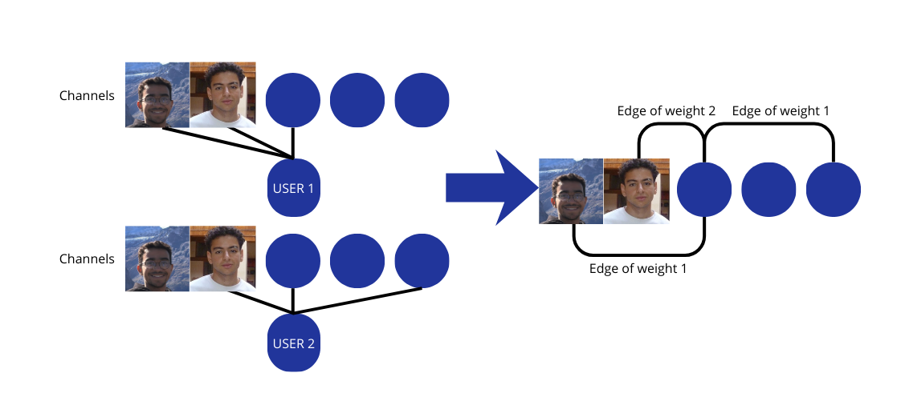

<head>

</head>

<!-- Section I: Introduction -->
<section id="introduction" class="section">
    Chapter I
    <h2>A Journey Through the YouNiverse</h2>
    
    <h3>Understanding the Scale of the YouNiverse</h3>
    

        Over the past two decades, YouTube has evolved from a simple video-sharing website into one of the largest social ecosystems ever created. With billions of viewers and creators interacting around the globe, it has become a global stage where cultures spread, trends emerge, and ideas collide.
    

    

        Today, YouTube is not just entertainment: it is a reflection of society, a mirror of human curiosity, and a massive accelerator of cultural exchange. From music to science, from gaming to politics, its content shapes our habits, our conversations, and often, our worldview.
    

    
    <!-- Stats about YouTube -->
    

        

            
136K+

            
Channels Analyzed

        

        

            
72M+

            
Videos (2005-2019)

        

        

            
14

            
Years of Data

        

    

    
    <h3>Revealing a Hidden Cosmic Landscape</h3>
    

        Given the sheer scale of interactions happening daily on the platform, we are convinced that YouTube cannot be understood as just a collection of videos; it behaves more like an immense digital world with its own internal order.
    

    

        And if we zoom out—far out—this world begins to resemble a vast cosmic landscape. Individual channels appear as stars; they cluster into large thematic galaxies, and within them, smaller constellations emerge around more specific interests.
    

    
    

        "What we experience as a chaotic stream of content may actually hide a structured universe governed by invisible forces of attraction between creators and their audiences."
    

    
    <h3>A Universe We Cannot See</h3>
    

        Yet, the inner order of this digital cosmos remains invisible. We travel through YouTube every day without ever seeing the structure that shapes what we discover, what we watch, and ultimately, what we think.
    

    

        With billions of interactions steering opinions, habits, and cultural currents, YouTube now functions as a parallel society—one whose architecture remains hidden from its own inhabitants.
    

    
    <h3>Our Expedition Map</h3>
    
To navigate this digital cosmos, our exploration is guided by four fundamental questions:

    
    

        

            
01

            
Galaxy Formation

            
How do channels cluster into audience-based galaxies?

        

        

            
02

            
Galaxy Identity

            
What thematic, structural, and temporal features distinguish these galaxies?

        

        

            
03

            
User Mobility

            
How do viewers travel across the YouNiverse? Do they remain confined to a single constellation?

        

        

            
04

            
Black Holes

            
Do certain channels capture disproportionate attention, shaping the dynamics of their galaxies?

        

    

</section>

<!-- Section II: Dataset -->
<section id="dataset" class="section">
    Chapter II
    <h2>Before We Explore: First Glimpses of the YouNiverse</h2>
    
    

        To answer these questions, we turned to the YouNiverse dataset. And the name truly does it justice, its size is that of a universe. Data from 73 million videos , 137 thousand channels and 8.6 billion comments from 449 million users on a timeframe from May 2005 to October 2019. The dataset claims to only hold data from english speaking videos (more on that later).
    

    

        Looking at this universe with the naked eye, we see a system that has grown exponentially since its 'big bang'. What started as a few flickering lights has evolved into a sprawling ecosystem. However, this growth is not uniform.
    

    
    

        

            
        

    

    

        When we peer through our telescope at these celestial bodies (channels), we notice a stark reality: size is not distributed equally. The distribution of views and subscribers follows a power law, a mathematical signature of winner-takes-all dynamics commonly observed in large-scale social systems. A few 'Supermassive' channels command the vast majority of the YouNiverse's light, while millions of smaller stars twinkle in the background. The top 1% of channels capture over 46% of all views, a cosmic inequality that shapes the entire ecosystem.
    

    

        

            
        

    

    

        To understand the nature of these stars, we first look at their "Spectra"—the content categories assigned to them. This provides a first-order view of what content dominates the YouNiverse, before asking how these channels interact. While this gives us a hint of their composition (Gaming, News, Education), categories alone don’t tell us how these stars interact.  
    

    

        

            
        

    

    

        To see the true architecture of the YouNiverse, we must board our spaceship and look at the gravitational bonds between them.
    

</section>

<section id="galaxies" class="section">
    Chapter III
    <h2>Constructing the Cosmic Map: From Comments to Galaxies</h2>
    
    

        To understand our YouNiverse, our objective to see what channels actually share common audiences. By doing this we will be able to run community detection algorithms and visualize types of interactions.
    

    

        To do this we will use the biggest file in our dataset, the comment data. We want to know which channels users most commented on. "We establish gravitational bonds between channels: when users orbit both, commenting frequently on each, we draw a connection weighted by the strength of their shared audience. The edge of these weights will then be first determined by the number of commenters they have in common. Two channels with many shared commenters are linked by strong gravitational bonds—they orbit in the same region of the YouNiverse.
    

    

        

            
        

    

    

        

            Demonstration of graph creation using <strong>the top 3 channels </strong> of the user.
        

    

    <h3>Normalizing the gravitational bonds</h3>
    

        In space, a massive sun has more gravity simply because it is big. On YouTube, two "Black Hole" channels (like PewDiePie and T-Series) might share many commenters just because they are famous, not because they are related. To find true communities, we had to "level the playing field" by normalizing our edge weights.

        We developed a Similarity Score to penalize the sheer size of a channel, ensuring that a "Galaxy" is formed by genuine audience overlap rather than just popularity.
        Imagine trying to see stars near the sun—their light is drowned out. Similarly, mega-channels like PewDiePie overshadow genuine connections. Our Similarity Score acts like a solar filter: it dims the giants proportionally to their size, revealing the authentic audience overlaps that define true communities.
    

    

    To see the true shape of the galaxies, we had to apply <strong>Gravitational Shielding</strong>. By using our similarity score, we effectively "muted" the blinding light of the Black Holes. This allowed us to see the faint, genuine connections between smaller stars that were previously invisible in the glare of the platform's giants. 
    

    

    
📊 The Mathematics of Normalization (Similarity Score)

    
    

        
<strong style="color: #ffffff;">The Problem:</strong> PewDiePie and T-Series might share 100,000 commenters simply because they each have 100 million subscribers. Meanwhile, two niche gaming channels sharing 500 commenters might have a much stronger cultural connection.

        
        
<strong style="color: #ffffff;">The Solution:</strong> We penalize large channels proportionally to their size:

        
        

            
$$size\_factor = \left( \frac{total\_commenters}{median\_commenters} \right)^\beta$$

            
$$penalty(c_1, c_2) = (size\_factor(c_1) \cdot size\_factor(c_2))^\alpha$$

            
$$Similarity\_Score = \frac{shared\_commenters}{penalty}$$

        

        <ul style="margin-top: 15px; list-style-type: none; padding-left: 0;">
            <li style="margin-bottom: 8px;"><strong style="color: #06b6d4;">size_factor</strong>: How much larger is this channel than typical channels?</li>
            <li style="margin-bottom: 8px;"><strong style="color: #06b6d4;">penalty</strong>: Expected overlap if connections were random.</li>
            <li style="margin-bottom: 8px;"><strong style="color: #06b6d4;">α, β</strong>: Tuning parameters (we used α=0.5, β=1).</li>
        </ul>
        
        

            <strong style="color: #8b5cf6;">Result:</strong> Two mega-channels need exponentially more shared commenters to appear "connected" than two small channels. This reveals genuine communities rather than just popularity contests.
        

    

    

    <h3>Filtering the Cosmic Noise</h3>
    

        Even with gravitational shielding applied, our universe still contained faint, unreliable connections, like distant radio signals lost in static. To build a clean map of meaningful relationships, we applied two critical filters to remove the cosmic noise.
    

    

        <strong>🔧 The Filtering Strategy:</strong>
        <ul style="margin: 10px 0 0 20px; line-height: 1.8;">
            <li><strong>Minimum Subscribers Filter:</strong> We excluded channels below 200,000 subscribers. These "proto-stars" haven't yet established stable audiences, making their connections unreliable indicators of community structure.</li>
            <li><strong>Minimum Edge Weight Filter:</strong> We removed edges with fewer than 25 shared commenters. Like eliminating background radiation, this ensures we only map gravitational bonds strong enough to define true communities.</li>
        </ul>
    

    

        Why these thresholds? Two reasons, aside from computational efficiency. Because of our top-5 channels logic, small channels frequently had very few shared commenters and by consequence too few edges for the analysis to actually be significant. Similarly, small weight edges were not consequential given the size of the dataset and the remaining channels. Through iterative testing, we have found out that the two chosen hyperparameters were the best balance to get meaningful communities.
    

    

        
📊 Impact of Filtering on Network Structure

    
    

        
<strong style="color: #ffffff;">Before Filtering:</strong>

        <ul style="margin-bottom: 20px; list-style-type: none; padding-left: 0;">
            <li style="margin-bottom: 5px;">• Nodes (channels): 129,996</li>
            <li style="margin-bottom: 5px;">• Edges (connections): 32,408,399</li>
        </ul>
        
        
<strong style="color: #ffffff;">After Filtering:</strong>

        <ul style="margin-bottom: 20px; list-style-type: none; padding-left: 0;">
            <li style="margin-bottom: 5px;">• Nodes (channels): 19,129</li>
            <li style="margin-bottom: 5px;">• Edges (connections):572,732</li>
        </ul>
    

    

        With our normalized map in hand, we applied the Louvain Community Detection algorithm. Think of this as a way to find where the "gas clouds" of users naturally condense into distinct structures.
    

    

    ✨ <strong>The Breakthrough:</strong> With gravitational shielding applied, distinct galaxies emerge from the chaos. Each represents a true audience community bound by shared interests, not just shared fame.
    

    

        Louvain seeks to maximize Modularity—a metric that measures how much "denser" the connections are within a galaxy compared to a random universe. Our map achieved a Modularity score of 0.655.
        In the world of network science, a score above 0.5 is a significant discovery. It confirms that the YouNiverse is not a chaotic cloud of random stars, but a structured system of distinct, high-density galaxies bound by shared cultures, languages, and interests.
    

    <h2>The Architecture of the YouNiverse</h2>
    
    

        By applying the Louvain algorithm, we successfully charted 52 distinct communities within the cosmic map. It became immediately clear that this universe is highly polarized: while some regions are vast, mainstream <strong>Super-Galaxies</strong>, others are small, isolated <strong>Niche Constellations</strong>. 
    

    

        The scale varies dramatically, the smallest of these communities contain as few as two channels, existing like distant binary stars in the deep void of the YouNiverse.
    

    

        Before diving deeper, let's label our communities with the biggest channel in each. This gives us the first valuable insights into what sort of galaxies is there in the YouNiverse.
    

    

        
The 52 Galaxies of the YouNiverse

        

            <iframe src="./a.html" width="100%" height="500px" frameborder="0"></iframe>
        

    

        

        

            
52

            
Galaxies Detected

        

        

            
0
.
655

            
Modularity Score

        

        

            
80

%

            
Channels in Top 5 Galaxies

        

    

    <h3>Inter-Community Flows: The Cosmic Connections</h3>
    

        To visualize how these 52 galaxies interact, we map the flows of attention between communities. Each ribbon in the chord diagram represents the strength of connections between galaxies, revealing which communities share audiences and how tightly they are bound together.
    

    

        The thickness and opacity of each connection reflect the normalized flow strength—stronger gravitational bonds appear more prominent, while weaker connections fade into the background. Hover over any connection to see the exact flow weight between two communities.
    

    <h3>The Core vs. The Periphery</h3>
    

        In the center of our map lies the <strong>Galactic Core</strong>. Here, the mainstream galaxies are so massive and their audiences so interconnected that their borders often blur together. Yet, despite this density, the Louvain algorithm reveals they remain distinct cultural entities with their own centers of gravity.
    

    

        Stretching out from this core are thin, elongated edges : the <strong>Interstellar Bridges</strong>. These represent bridge channels that link the mainstream center to peripheral niche clusters. These channels serve as the connective tissue of the YouNiverse, allowing users to travel between vastly different content worlds.
    

    

        "The YouNiverse is not a single mass, but a complex web where the mainstream core and niche satellites are held together by the gravity of shared audiences."
    

    <h3>A Voyage into the Core</h3>
    

        To understand the internal divisions of the most dominant communities, we must look past the "space dust" of the periphery. By zooming into the core, we can observe the fine-tuned interactions and galaxies that shape the most popular regions of YouTube.
    

    

        
Core Exploration Map 

        

            Showing the 5 biggest galaxies, those that form the core of our universe.
        

        

            <iframe src="./b.html" width="100%" height="500px" frameborder="0" style="border:none; display: block;"></iframe>
        

    

    <h3>First Contact: A Glimpse Into Three Galaxies</h3>
    

        Before we systematically analyze all galaxies, let's descend into three interesting, yet very small compared to the size of the major galaxies, ones. We will quickly analyze what sort of channels lie in them to determine how they came to be. They define three contrasting types of communities. Do not hesitate to click on the little nodes to get the names of the channels and their total strength in the graph.
    

    <!-- Galaxy 1: Graph Left, Text Right -->
    

        
        

            <!-- Insert your galaxy visualization here -->
            <iframe src="./galaxy_25.html" width="100%" height="300px" frameborder="0"></iframe>
        

        
        

            

                
🎾

                

                    <h4 style="color: #64b5f6; margin: 0;">Tennis Terror</h4>
                    

                        Galaxy #25 • 6 channels • Biggest channel : Tennis TV
                    

                

            

            

                A small, tight-knit community around a passion for one sport : Tennis.  
            

            
        

        
    

    <!-- Galaxy 2: Text Left, Graph Right -->
    

        
        

            

                
🇲🇦🇹🇳

                

                    <h4 style="color: #ab47bc; margin: 0;">Maghrebi Power</h4>
                    

                        Galaxy #25 • 32 channels • Biggest channel : 7liwa
                    

                

            

            

                A single galaxy with what seems to be two different galaxies connected by two heavily interacting channels. Quick overview of these channels leads us to see that on one part we have some Moroccan singers and on the other side Tunisian ones.
            

        

        
        

            <!-- Insert your galaxy visualization here -->
            <iframe src="./galaxy_26.html" width="100%" height="300px" frameborder="0"></iframe>
        

        
    

    <!-- Galaxy 3: Graph Left, Text Right -->
    

        
    

        <!-- Insert your galaxy visualization here -->
        <iframe src="./galaxy_24.html" width="100%" height="300px" frameborder="0"></iframe>
        <!-- OR -->
        <!--  -->
    

    
    

        

            
🏴󠁧󠁢󠁥󠁮󠁧󠁿

            

                <h4 style="color: #ffc107; margin: 0;">English Learners</h4>
                

                    Galaxy #24 • 45 channels • Biggest channel : Go Natural English
                

            

        

        

            Probably a hub for recharging your spacecraft before going exploring. This is a community based around learning the biggest language on the website (and the world), English. 
        

    

    
    

    

        "From isolated echo chambers to sprawling hubs, each galaxy reveals a different way communities form and interact."
    

    

        These three examples showcase the diversity we've discovered. In the next chapter, we will systematically analyze what truly distinguishes all major galaxies in the YouNiverse.
    

    <h3>What We've Discovered</h3>
    

        By building our cosmic map from 8.6 billion comments across 19,000 channels, we've revealed something remarkable: <strong>YouTube isn't a chaotic cloud of random content</strong>. It's a structured universe with 52 distinct cultural galaxies, each with its own centers of gravity, its own audiences, and its own identity.
    

    

        The modularity score of 0.655 confirms what we suspected: users don't wander randomly across YouTube. They orbit within specific communities, occasionally traveling between galaxies through bridge channels, but largely remaining within their cultural home.
    

    

        With our map complete, we can now begin the real voyage: <strong>descending into each galaxy to meet its inhabitants, understand its culture, and trace the journeys of travelers between worlds.</strong>
    

    

        "The YouNiverse is not a single universe, but a multiverse, 52 parallel worlds occupying the same digital space, each invisible to the others unless you know where to look."
    

</section>
<section id="temporal" class="section">
    Chapter IV
    <h2>A Decade of Transformation</h2>

    <h3>Slicing Time: Investigating the Invisible Shift</h3>
    

        To truly understand the evolution of the YouNiverse, viewing it as a static map is not enough; we must observe it as a living organism. A dataset spanning 14 years flattens history—it hides the dramatic shifts in culture, influence, and structure that occurred between the first viral hits and the modern creator economy.
    

    

        To capture this motion, we employed a <strong>temporal snapshot methodology</strong>. By slicing our data into distinct one-year windows, we isolated the interactions of each era. This allowed us to build independent universes for 2010, 2011, through to 2019, enabling us to watch the laws of digital gravity change in real-time. What we found was not a linear expansion, but a complete structural metamorphosis from a unified community to a fractured multiverse.
    

    <h3>The Big Bang of Communities</h3>
    

        The most fundamental shift in the ecosystem is a massive <strong>+518% fragmentation</strong> of the network structure. In 2010, our community detection algorithms identified only <strong>16 distinct clusters</strong>. At this stage, YouTube acted as a "digital town square": audiences were forced to mingle because there were simply fewer distinct cultural spaces to inhabit.
    

    

        By 2019, this number had exploded to <strong>99 distinct communities</strong>. This fragmentation was driven by two major cosmic events visible on the timeline: the <strong>Gaming explosion</strong> (starting around 2012) and the <strong>Indian expansion</strong> (triggered by Jio in 2016).
    

    

        <strong>The Implication:</strong> This is not an accidental fracture, but a necessary adaptation to abundance. As the platform flooded with content, the "shared experience" became impossible to maintain. To survive the cognitive load, audiences naturally segregated into <strong>cognitive silos</strong>. Viewers retreated into hyper-specific clusters—from K-Pop to Minecraft—turning shared interests into hermetic worlds that rarely interact.
    

    <iframe src="./fragmentation.html" width="100%" height="500px" style="border:none; display: block; margin: 20px auto; background:#000000;" scrolling="no" frameborder="0"></iframe>
    <h3>The Connectivity Paradox</h3>

    This creation of silos leads us to a startling paradox: <strong>as the universe expanded, it became less connected</strong>. While the number of channels grew five-fold, the structural density of the network collapsed.

    To understand the scale of this collapse, we must look at how density D is calculated:

    $$D = \frac{\text{Number of actual edges}}{\text{Number of possible edges}}$$

    In 2010, the network density was <strong>0.05</strong>. In simple terms, out of all possible conversations between communities, 5% actually happened. It was a "small world" where distinct groups frequently rubbed shoulders. By 2019, this density had flatlined to <strong>0.002</strong>—a staggering <strong>96% drop</strong> in relative connectivity.

<iframe src="./density.html" width="100%" height="500px" style="border:none; display: block; margin: 20px auto; background:#000000;" scrolling="no" frameborder="0"></iframe>

    This curve is the <strong>filter bubble made visible</strong>. The mathematical collapse of D represents the death of serendipity. As algorithms got better at prediction, they stopped building bridges between galaxies. Viewers stayed in their comfortable corners, and the "global conversation" of 2010 dissolved into thousands of private, parallel conversations.

<h3>Galaxies Rising and Fading</h3>
    

        The heart of the YouNiverse has undergone a seismic transition. Our <strong>PageRank centrality</strong> analysis — a measure of structural influence based on how audiences move between channels — captures the fall of an empire and the birth of a new one.
    

    
    <ul>
        <li><strong>The Great Passing of the Torch (2012):</strong> In 2010, Music (red curve 🔴) reigned supreme, commanding over 30% of the platform's total influence. By 2012, the graph shows a historic crossover: the beginning of the <strong>Gaming Era</strong> (green curve 🟢). Let's Play creators shifted from peripheral niches to becoming the platform's new centers of gravity.</li>
        <li><strong>The Decline of Music:</strong> Once a central pillar, Music saw its structural influence steadily collapse as discovery migrated to dedicated streaming services. This trend shows YouTube evolving from a "video radio" into a home for community-driven creator content.</li>
        <li><strong>The Quiet Ascent:</strong> While Gaming and Music fought for the top spot, other galaxies grew steadily. Categories like <strong>Entertainment</strong> (blue curve 🔵) and <strong>People & Blogs</strong> (purple curve 🟣) saw consistent growth, proving that the YouNiverse has diversified far beyond simple passive entertainment.</li>
    </ul>

    <iframe src="./pagerank.html" width="100%" height="500px" style="border:none; display:block; margin:20px auto; background:#000000;" scrolling="no" frameborder="0"></iframe><h3>The Emergence of New Powers: The Jio Effect</h3>
    

        While the Western core was busy transitioning into the Gaming Era, a seismic shift was happening on the periphery. Our temporal tracking reveals the emergence of massive regional superpowers that fundamentally changed the scale of the YouNiverse.
    

    
    

        The most prominent example is the <strong>"Jio Effect" of 2016</strong>. As seen in our fragmentation data, the entry of millions of Indian users led to a sudden spike in community detected. This era birthed the massive <strong>T-Series galaxy</strong>. As shown in the "Evolution of Top 5 Identities" chart, by 2016, T-Series shifted from a peripheral node to the third-largest community on the entire platform.
    

    <iframe src="./top5_identities.html" width="100%" height="550px" style="border:none; display: block; margin: 20px auto; background:#000000;" scrolling="no" frameborder="0"></iframe>

    

        <strong>Parallel Worlds:</strong> What makes this growth remarkable is its isolation. Despite becoming a global giant, the T-Series galaxy grew with almost zero audience overlap with Western giants like PewDiePie. This proved that the YouNiverse was no longer a single shared experience, but a <strong>multiverse of parallel worlds</strong>. By 2019, YouTube had become a collection of massive, independent islands—vibrant and rich, yet structurally invisible to one another.
    

<h3>Visualizing the Drift: A Universe in Motion</h3>
    
    

        Animating these annual snapshots through our physics engine reveals the structural explosion of the network. In 2010, the ecosystem appears as a compact, monolithic block: there are few communities, and they are all tightly interconnected within a restricted space, forming a cohesive mass.
    

    

        Over the decade, the sheer pressure of growth fractures this block. The number of communities rises drastically, creating a centrifugal force that propels new "niche galaxies" outward. The final result in 2019 is no longer a unified network, but a vast archipelago: a fusing core persists at the center, surrounded by a multitude of specialized islands floating on the periphery, orbiting far from the central gravity without ever touching it.
    

    <iframe src="./galaxy_explorer.html" width="100%" height="700px" style="border:none; display: block; margin: 20px auto;"></iframe>

    

        <em>Interactive Model: Drag nodes to explore connections, use the slider to travel through time.</em>
    

    

        "The YouNiverse transformed from a unified town square into a constellation of isolated worlds."
    

</section>
<!-- Section IV: Galaxy Identity -->
<section id="identity" class="section">
    Chapter V
    <h2>Understanding the Identity of Galaxies</h2>
    
    

        We've mapped 52 galaxies, but what makes each one unique? YouTube assigns categories to channels, but these official labels only scratch the surface. A "Music" galaxy in one region might be entirely different from another. To truly understand each galaxy's identity, we need to look deeper: into the content itself, the language, and the behavior of its inhabitants.
    

    <h3>Reading the Stars: Topic Detection with LDA</h3>
    

        We deployed <strong>Latent Dirichlet Allocation (LDA)</strong> on video titles and descriptions from the 10 largest galaxies. Using POS-filtering (nouns, proper nouns, adjectives) and bigram detection, we extract the hidden thematic structure within each community—the actual topics people talk about, not just the labels YouTube assigns.
    

    
    

        The results largely validate YouTube's categorization while revealing rich subcultures within each galaxy. Regional ecosystems also emerge, with entire non-English communities thriving in an allegedly "English-only" dataset.
    

    

        

            <iframe src="./topic_explorer.html" width="100%" height="480px" frameborder="0" style="border:none;"></iframe>
        

    

    <h3>The Language Barrier: Regional Galaxies Emerge</h3>
    

        One striking discovery: language creates galaxies. Despite the YouNiverse dataset claiming to contain only "English-speaking" content, our analysis reveals massive non-English communities bound together by shared language.
    

    

        <strong>🌍 Language-Based Galaxies Discovered:</strong>
        <ul style="margin: 10px 0 0 20px; line-height: 1.8;">
            <li><strong>🇮🇳 Galaxy #0 - Indian Entertainment Hub (3,187 channels):</strong> Bollywood dominates (Filmfare, Salman Khan, Varun Dhawan). Hindi beauty tips, Navratri celebrations, and PUBG Mobile.</li>
            <li><strong>🇵🇭 Galaxy #7 - Filipino Entertainment Hub (596 channels):</strong> Mobile Legends: Bang Bang is the gravitational center. ABS-CBN content, Himig Handog music, and Filipino language (ang, lang, ako, ikaw).</li>
        </ul>
    

    

        These linguistic gravitational bonds are so strong that they override thematic connections. An Indian gamer has more in common with an Indian news channel than with an American gamer—at least in terms of shared audience.
    

    

        "In the YouNiverse, language isn't just communication—it's gravity. Speakers of the same language orbit together, regardless of content type."
    

    <h3>Categories Confirmed: LDA Validates YouTube Labels</h3>
    

        Interestingly, our LDA analysis largely confirms YouTube's category assignments. The detected topics align remarkably well with the official labels:
    

    

        <strong>✅ Category-Topic Alignment:</strong>
        <ul style="margin: 10px 0 0 20px; line-height: 1.8;">
            <li><strong>Galaxy #1 (Gaming 48%):</strong> GTA mods, Roblox, Minecraft roleplay ✓</li>
            <li><strong>Galaxy #2 (Music 64%):</strong> Ariana Grande, Nicki Minaj, chill playlists ✓</li>
            <li><strong>Galaxy #3 (Howto & Style 31%):</strong> Vlogs, makeup tutorials, hauls ✓</li>
            <li><strong>Galaxy #9 (Autos & Vehicles 42%):</strong> Car reviews, bikes, off-road ✓</li>
        </ul>
    

    

        This validates that <strong>co-commenting behavior reflects genuine content affinity</strong>. Users who comment together genuinely share interests that match the channel's official category—the community structure is real.
    

    <h3>Behavioral Signatures: How Galaxies Engage</h3>
    

        Beyond topics, each galaxy has a distinct behavioral fingerprint. By analyzing engagement metrics across millions of videos, we uncovered dramatically different patterns of audience interaction.
    

    

        

            <iframe src="./engagement_metrics.html" width="100%" height="560px" frameborder="0" style="border:none;"></iframe>
        

    

    <h3>The Engagement Paradox</h3>
    

        Our analysis reveals a fascinating paradox: <strong>the most-viewed content isn't the most engaging</strong>.
    

    <!-- Engagement insights grid -->
    

        
        

            
🏆

            <h4 style="color: #f59e0b; margin: 0 0 10px 0;">Most Engaged: Galaxy #3 - Vlogs & Lifestyle</h4>
            

                <strong>26.9 likes per 1000 views</strong> 
                Makeup tutorials, hauls, and vlogs create devoted communities. These viewers don't just watch—they comment, share tips, and build relationships with creators.
            

        

        
        

            
👁️

            <h4 style="color: #14b8a6; margin: 0 0 10px 0;">The Viral Void: Galaxy #8 - ASMR & Kids</h4>
            

                <strong>133K median views, only 4.0 engagement</strong> 
                Slime, soap cutting, and satisfying compilations—optimized for the algorithm, not connection. Viewers consume passively without forming lasting communities.
            

        

        
    

    <h3>Duration Tells a Story</h3>
    

        Video length isn't random—it reflects the content type and audience expectations of each galaxy.
    

    

        

            
18.3

            
min - Galaxy #5 Fitness (Workout videos, vegan recipes)

        

        

            
8.0

            
min - Galaxy #2 Pop Music (Music videos, playlists)

        

        

            
16.1

            
min - Galaxy #1 Gaming (Let's plays, GTA mods)

        

    

    

        <strong>Fitness content (Galaxy #5)</strong> demands the longest attention—Buff Dudes workouts, vegan recipes, and Law of Attraction manifestation videos average 18+ minutes. <strong>Pop Music (Galaxy #2)</strong> lives in quick 8-minute bursts: music videos and playlist compilations.
    

    <h3>The Galaxy Classification System</h3>
    

        Combining topic analysis and behavioral metrics, we can classify our galaxies into distinct types:
    

    

        

            
🌐

            <h4 style="color: #8b5cf6; margin: 10px 0 5px 0;">Global Galaxies</h4>
            
#1 Gaming, #2 Music, #8 ASMR Content transcends language

        

        

            
🗣️

            <h4 style="color: #ec4899; margin: 10px 0 5px 0;">Regional Galaxies</h4>
            
#0 Indian, #7 Filipino Bound by language

        

        

            
🎯

            <h4 style="color: #06b6d4; margin: 10px 0 5px 0;">Engaged Galaxies</h4>
            
#3 Vlogs, #5 Fitness High engagement, tight communities

        

    

    

        "Identity in the YouNiverse is multi-dimensional: what you talk about, what language you speak, how long you watch, and how much you engage all combine to define your galactic home."
    

    <h3>What We've Learned About Galaxy Identity</h3>
    

        Our deep dive into the 10 largest galaxies reveals that <strong>YouTube's official categories are only part of the story</strong>. The true identity of a galaxy emerges from the intersection of:
    

    <ul style="color: #e2e2ed; line-height: 2;">
        <li><strong>Thematic content:</strong> What topics dominate the conversation</li>
        <li><strong>Language:</strong> The gravitational force that binds regional communities</li>
        <li><strong>Engagement patterns:</strong> Active fans vs. passive consumers</li>
        <li><strong>Content format:</strong> Long-form immersion vs. short-form consumption</li>
    </ul>
    
    

        With the identity of each galaxy now mapped, our next question becomes: <strong>how do travelers move between these worlds?</strong> Do they stay loyal to their home galaxy, or do they explore the broader universe?
    

</section>

<!-- Section V: User Navigation -->
<section id="navigation" class="section">
    Chapter VI
    <h2>Navigating the YouNiverse: How Do Users Travel Between Galaxies?</h2>
    
    

        We've mapped 52 galaxies, decoded their identities, and watched the universe fragment over a decade. But one question remains unanswered: <strong>do the inhabitants of these galaxies stay home, or do they wander?</strong>
    

    

        In the physical universe, stars rarely leave their galaxies. But in the YouNiverse, viewers have no such constraints—a single click can transport them from a Gaming stream to a Music video to a Political commentary. To understand these journeys, we must first map the highways that connect the galaxies.
    

    <h3>The Cosmic Highway: Where Does Attention Flow?</h3>
    

        Yet some attention <em>does</em> escape. Where does it go? To visualize the inter-galactic traffic, we constructed a <strong>chord diagram</strong> of all 52 communities. Each arc represents a galaxy's size, and ribbons show the flow of shared audience between them—the thicker the ribbon, the stronger the gravitational bond.
    

    

        

            <iframe src="./chord_visible.html" width="100%" height="900px" frameborder="0" scrolling="no" style="border:none; display: block; overflow:hidden;"></iframe>
        

    

    

        

            Use the slider to filter communities by size. Watch how the network transforms as smaller galaxies disappear, revealing the backbone of the YouNiverse.
        

    

    

        The full view (all 52 communities) appears chaotic—a dense web of crisscrossing ribbons. But look closer: <strong>C18</strong> (the large green arc) dominates the landscape. Its ribbons stretch to nearly every corner of the diagram, making it the gravitational center of the YouNiverse. Similarly, <strong>C0</strong> and <strong>C11</strong> act as major hubs.
    

    

        Now drag the slider to show only the <strong>top 10 communities</strong>. The chaos resolves into clarity: a dense, tightly-interconnected core emerges. The strongest corridors become visible—<strong>C18 ↔ C31</strong>, <strong>C18 ↔ C13</strong>, <strong>C18 ↔ C3</strong>—highways where millions of viewers travel between galaxies.
    

    

        <strong>🛤️ The Core Highway System:</strong>
        <ul style="margin: 10px 0 0 20px; line-height: 1.8;">
            <li><strong>C18:</strong> The absolute center—connected to virtually everyone with thick, prominent ribbons</li>
            <li><strong>C31, C13, C3:</strong> Major satellites orbiting C18 with strong bidirectional flows</li>
            <li><strong>C0, C4, C5, C10, C11:</strong> Secondary hubs forming the densely-connected Galactic Core</li>
            <li><strong>C34–C51:</strong> Tiny peripheral communities—barely visible arcs with thin or no connections</li>
        </ul>
    

    

        The chord diagram reveals a stark <strong>hub-and-spoke structure</strong>. The top 10 galaxies form a tightly-bound core where attention flows freely. Meanwhile, the 40+ smaller communities on the periphery exist as isolated islands—their thin ribbons (if any) connect only to the nearest hub, never to each other. The YouNiverse isn't a uniform web; it's a hierarchical network with clear highways and dead ends.
    

    <h3>Bridge Channels: The Cosmic Connectors</h3>
    

        If most viewers stay home, who are the travelers that connect different worlds? Using <strong>cross-community interaction analysis</strong>, we identified the bridge channels: creators whose audiences span multiple galaxies. Each bar shows a channel's <strong>cross-strength</strong> (total external connections), while the number indicates their <strong>cross-share</strong> (fraction of connections going outside).
    

    

        

            <iframe src="./bridge_channels_interactive.html" width="100%" height="850px" frameborder="0" scrolling="no" style="border:none; display: block; overflow:hidden;"></iframe>
        

    

    

        Use the slider to explore all 52 communities. The visualization reveals a dramatic spectrum: some galaxies have <strong>mega-bridges</strong> with hundreds of thousands of cross-community connections, while others are so isolated that <em>every single channel</em> has a cross-share of zero.
    

    

        <strong>🏆 The Mega-Bridges of the YouNiverse:</strong>
        <ul style="margin: 10px 0 0 20px; line-height: 1.8;">
            <li><strong>WWE (C5):</strong> ~350K cross-strength, 0.82 cross-share — THE biggest bridge in the entire YouNiverse. Wrestling transcends community boundaries like nothing else.</li>
            <li><strong>Mo Vlogs (C0):</strong> ~150K cross-strength — Vlogging's universal appeal bridges the massive Indian Entertainment hub to the world</li>
            <li><strong>CaseyNeistat (C18):</strong> ~80K cross-strength — The vlog king connects lifestyle content to dozens of galaxies</li>
            <li><strong>TechRax (C10):</strong> ~55K cross-strength, 0.82 cross-share — Tech destruction videos bridge Tech and Entertainment</li>
            <li><strong>AWE me (C31):</strong> ~40K cross-strength — "Man at Arms" forges weapons from games, bridging Gaming and Entertainment</li>
        </ul>
    

    

        But the most striking finding lies in the <strong>isolated communities</strong>. Scroll to <strong>Community 34</strong> (Crafts/Quilting): nearly every channel shows <strong>0.00 cross-share</strong>. These viewers exclusively watch quilting content—they never venture into Gaming or Music. Similarly, <strong>Community 22</strong> (Tennis) features official channels like Roland Garros and ATP Tour with zero external connections. Some galaxies are perfect echo chambers.
    

    

        <strong>🔒 The Sealed Vaults (Communities with no/few bridges):</strong>
        <ul style="margin: 10px 0 0 20px; line-height: 1.8;">
            <li><strong>C34 (Crafts/Quilting):</strong> All Crafts Channel, Ruby Stedman — cross-shares of 0.00-0.09</li>
            <li><strong>C22 (Tennis):</strong> Roland Garros, ATP Tour — 0.00 cross-share despite global reach</li>
            <li><strong>C7 (Filipino Gaming):</strong> VPROGAME, Seak Gaming — cross-shares of 0.03-0.12</li>
            <li><strong>C17 (Northeast Indian):</strong> TANTHA, MAMI TAIBANG — cross-shares around 0.10-0.16</li>
            <li><strong>C35, C38, C41, C44, C47, C50:</strong> No visible bridge channels at all</li>
        </ul>
    

    <h3>The Anatomy of a Bridge</h3>
    

        What makes a channel become a bridge? Looking across communities, clear patterns emerge:
    

    

        

            
🎭

            <h4 style="color: #f59e0b; margin: 10px 0 5px 0;">Entertainment Variety</h4>
            
WWE, First We Feast, AWE me Broad appeal = massive bridging

        

        

            
📹

            <h4 style="color: #8b5cf6; margin: 10px 0 5px 0;">Vlogging Giants</h4>
            
CaseyNeistat, Mo Vlogs Personal stories transcend niches

        

        

            
🔧

            <h4 style="color: #06b6d4; margin: 10px 0 5px 0;">Tech Crossovers</h4>
            
TechRax, TechSmartt Destruction + reviews = viral bridging

        

    

    

        Meanwhile, <strong>regional content</strong> (Sri Lankan, Filipino, Nepali), <strong>niche hobbies</strong> (quilting, roller coasters, dog training), and surprisingly <strong>professional sports leagues</strong> (Tennis) create the strongest echo chambers. The lesson: universality bridges, specificity isolates.
    

    <h3>What Types of Content Build Bridges?</h3>
    

        An intriguing question emerges: <strong>which content categories are most likely to produce bridge channels?</strong> We aggregated bridge channels by their YouTube category to reveal the "bridge-building" power of different content types across all 52 communities.
    

    

        

            <iframe src="./bridge_categories_top3.html" width="100%" height="600px" frameborder="0" scrolling="no" style="border:none; display: block; overflow:hidden;"></iframe>
        

    

    

        The chart reveals a stunning concentration of bridging power. <strong>Community 18</strong> towers above all others with nearly <strong>10 million total cross-strength</strong>—and the breakdown tells a story: People & Blogs (purple) contributes ~7M alone, with Music (cyan) adding another ~3M. This is the home of CaseyNeistat and the vlogging giants—personal stories that resonate across every community.
    

    

        <strong>🌉 The Bridge-Building Hierarchy:</strong>
        <ul style="margin: 10px 0 0 20px; line-height: 1.8;">
            <li><strong>People & Blogs (Purple):</strong> THE dominant bridge category — personal, relatable content transcends all boundaries</li>
            <li><strong>Entertainment (Dark Purple):</strong> Strong in C11, C14, C31 — variety and reactions appeal universally</li>
            <li><strong>Music (Cyan):</strong> Significant contributor across multiple communities — the universal language</li>
            <li><strong>Sports (Red):</strong> Only significant in C5 (WWE) — professional wrestling is uniquely bridging</li>
            <li><strong>Science & Technology (Gray):</strong> Visible in C10 — tech reviews and destruction videos cross boundaries</li>
        </ul>
    

    

        But the most striking insight is what's <em>missing</em>. Look for <strong>Gaming (orange)</strong>—it's barely visible anywhere. Despite Gaming being one of the largest categories on YouTube, gamers don't build bridges. They stay in their lanes: Minecraft viewers watch Minecraft, Fortnite viewers watch Fortnite. The same applies to <strong>News & Politics</strong> (yellow) and <strong>Education</strong> (pink)—these categories reinforce community boundaries rather than cross them.
    

    

        

            
🌉

            <h4 style="color: #a855f7; margin: 0 0 10px 0;">Categories That Bridge</h4>
            

                <strong>People & Blogs, Entertainment, Music</strong> 
                Emotionally-driven, broadly relatable content. No specialized knowledge required—anyone can enjoy a vlog or a song.
            

        

        

            
🔒

            <h4 style="color: #ef4444; margin: 0 0 10px 0;">Categories That Isolate</h4>
            

                <strong>Gaming, News & Politics, Education</strong> 
                Specialized, topic-specific content. You either care about this game/topic or you don't—no casual crossover.
            

        

    

    

        "In the YouNiverse, human stories connect; specialized knowledge divides. The vlogger bridges worlds; the gamer stays home."
    

    <h3>Directional Flows: Where Do Travelers Actually Go?</h3>
    

        Not all traffic is equal. Some galaxies <em>export</em> attention while others <em>import</em> it. To understand the <strong>directionality</strong> of audience flow, we mapped the top inter-community corridors—the highways where the most traffic flows.
    

    

        

            <iframe src="./bridge_community_topflows.html" width="100%" height="750px" frameborder="0" scrolling="no" style="border:none; display: block; margin-top: 0px;"></iframe>
        

    

    

        The flow map reveals the <strong>central nervous system</strong> of the YouNiverse. One corridor dominates all others: C17 ↔ C20 carries a combined ~127,000 normalized flow—more than double any other route. This is the main highway of the YouNiverse, a bidirectional channel where massive audiences cross between communities.
    

    

        <strong>🛣️ The Top 5 Highways of the YouNiverse:</strong>
        <ol style="margin: 10px 0 0 20px; line-height: 1.8;">
            <li><strong>C17 → C20:</strong> ~70K flow — The single largest directional corridor</li>
            <li><strong>C20 → C17:</strong> ~57K flow — Strong return traffic (bidirectional)</li>
            <li><strong>C17 → C10:</strong> ~55K flow — Major route to the Tech hub</li>
            <li><strong>C10 → C17:</strong> ~32K flow — Asymmetric return</li>
            <li><strong>C20 → C9:</strong> ~18K flow — Secondary corridor</li>
        </ol>
    

    

        <strong>C17 emerges as the routing hub</strong> of the YouNiverse—it appears in nearly every top flow, both as source and destination. This community acts as a crossroads where travelers from multiple galaxies pass through. Meanwhile, notice what's <em>missing</em>: <strong>C0</strong> (the massive Indian Entertainment hub) appears only once, at the very bottom (C0 → C13). Despite its enormous size, it remains isolated—audiences go in but rarely come out.
    

    <h3>Asymmetric Gravity: The Direction of Attention</h3>
    

        The flows reveal <strong>asymmetric relationships</strong>. Compare these pairs:
    

    

        

            
C17 → C10: 55K

            
C10 → C17: 32K

            
C17 exports 72% more than it receives from C10

        

        

            
C17 → C20: 70K

            
C20 → C17: 57K

            
Nearly balanced, but C17 still exports ~23% more

        

    

    

        The pattern is consistent: <strong>C17 is a net exporter of attention</strong>. It acts as a distribution hub, routing audiences to multiple destinations (C20, C10, C9, C16, C2, C29, C15) while receiving less in return. This makes C17 a gateway community—a rare bridge that actively pushes viewers to explore beyond their home galaxy.
    

    

        "Most galaxies are black holes that consume attention. C17 is the rare supernova—it radiates viewers outward across the YouNiverse."
    

    <h3>The Echo Chamber Revelation</h3>
    

        We've traced the highways, identified the bridges, and mapped the traffic flows. But here's the sobering truth: <strong>most viewers never use these connections</strong>. To quantify this isolation, we computed the <strong>external share</strong> for each community—what percentage of a galaxy's total interaction weight flows <em>outside</em> its borders?
    

    

        

            <iframe src="./echo_chamber_external_share.html" width="100%" height="500px" frameborder="0" scrolling="no" style="border:none; display: block; overflow:hidden;"></iframe>
        

    

    

        The results are striking. On the left, <strong>purple bars</strong> mark the most isolated communities—galaxies where less than <strong>7.5%</strong> of audience interaction escapes their borders. On the right, a few exceptional communities reach external shares of <strong>30-40%</strong>. But look at the distribution: the vast majority cluster below 25%.
    

    

        The range is staggering: <strong>C34</strong> (Crafts/Quilting) keeps 99% of its attention internal—only 1% external share. Meanwhile, <strong>C28</strong> sends 40% of its interactions to other galaxies. Yet C28 is the exception. For most communities, the walls are high and the gates rarely open.
    

    

        <strong>🔒 The Echo Chambers (Purple Bars < 7.5%):</strong>
        <ul style="margin: 10px 0 0 20px; line-height: 1.8;">
            <li><strong>C34, C44, C16:</strong> The most sealed vaults—external shares below 3%</li>
            <li><strong>C24, C33, C22, C7, C12:</strong> Tight-knit communities around 3-4%</li>
            <li><strong>C0, C17, C45, C26:</strong> Just below the threshold at 5-7%</li>
        </ul>
    

    

        <strong>🌐 The Open Crossroads (Top 5 External Share):</strong>
        <ul style="margin: 10px 0 0 20px; line-height: 1.8;">
            <li><strong>C28:</strong> ~40% external share—the most connected galaxy in the YouNiverse</li>
            <li><strong>C10:</strong> ~36% external share</li>
            <li><strong>C5:</strong> ~33% external share</li>
            <li><strong>C23, C3:</strong> ~31-32% external share</li>
        </ul>
    

    

        Notice something surprising: <strong>C0</strong>—the massive Indian Entertainment hub with over 3,000 channels—sits among the echo chambers with only ~5% external share. Despite its enormous size, its audience rarely ventures outside. Size doesn't guarantee openness; in fact, regional and linguistic galaxies often form the tightest bubbles.
    

    

        "In a universe of infinite content, most viewers choose to orbit a single star, never exploring what lies beyond their gravitational home."
    

    <h3>The Navigation Paradox</h3>
    

        Our analysis reveals a fundamental paradox of the YouNiverse:
    

    

        

            
🔒

            <h4 style="color: #ef4444; margin: 0 0 10px 0;">The Walls</h4>
            

                Most viewers are <strong>trapped</strong> in their home galaxy. External shares below 15% mean ideas rarely cross borders. Echo chambers are the norm, not the exception.
            

        

        

            
🌉

            <h4 style="color: #06b6d4; margin: 0 0 10px 0;">The Bridges</h4>
            

                Yet bridges <strong>exist</strong>. A small number of channels—often Entertainment and Music creators—serve as wormholes connecting distant worlds.
            

        

    

    

        "The YouNiverse is simultaneously connected and fragmented. Every galaxy touches the cosmic web, yet most inhabitants never use the bridges available to them."
    

    <h3>What This Means for the YouNiverse</h3>
    

        The navigation patterns we've uncovered have profound implications:
    

    <ul style="color: #e2e2ed; line-height: 2;">
        <li><strong>Filter bubbles are real:</strong> The algorithm doesn't need to trap you—viewers trap themselves by gravitating toward familiar content</li>
        <li><strong>Bridges are crucial:</strong> The few channels that connect communities play an outsized role in cultural exchange</li>
        <li><strong>Mainstream matters:</strong> Large Entertainment and Music galaxies serve as the crossroads of the YouNiverse—remove them, and the network fragments into isolated islands</li>
    </ul>
    
    

        With the highways and walls of the YouNiverse now mapped, one final question beckons: <strong>who controls these galaxies?</strong> In every community, a few channels capture disproportionate attention. These Black Holes warp the fabric of their entire region...
    

</section>

<!-- Section VI: Black Holes -->
<section id="blackholes" class="section">
    Chapter VII
    <h2>The Black Holes of the YouNiverse</h2>
    <h3>When Attention Collapses Around a Few Stars</h3>
    
    

        In every galaxy, a few channels exert disproportionate gravitational pull. These "black holes" capture massive amounts of attention, shaping the dynamics of their entire region.
    

    
    <h3>Attention Distribution</h3>
    

        Using Gini coefficients, we quantify the inequality of attention distribution. The results confirm what many suspect: YouTube exhibits a "winner-takes-all" dynamic.
    

    
    

        
Attention Inequality Across Galaxies

        

            <!-- Gini coefficient visualization will be inserted here -->
            [Interactive visualization coming soon]
        

    

    
    <h3>Identifying the Black Holes</h3>
    

        Who are the black holes of each galaxy? What characteristics do they share? Our analysis reveals patterns in posting frequency, video duration, and content style.
    

    
    

        
Black Hole Channels by Galaxy

        

            <!-- Black hole channels visualization will be inserted here -->
            [Interactive visualization coming soon]
        

    

    
    <h3>Influence on Surrounding Channels</h3>
    

        Do black holes drive the content and dynamics of smaller channels in their orbit? Our time series analysis reveals how dominant channels influence their neighbors.
    

    
    

        "With great reach comes great responsibility. The black holes of YouTube don't just consume attention—they shape the very fabric of their galaxies."
    

</section>

<!-- Conclusion -->
<section class="section">
    Epilogue
    <h2>Charting the Future of the YouNiverse</h2>
    
    

        Our voyage through the YouNiverse has revealed a structured cosmos hidden beneath the surface of YouTube's endless content stream. We've mapped galaxies bound by shared audiences, identified echo chambers and bridge channels, and exposed the black holes that shape attention flows.
    

    
    

        As the platform continues to evolve, so will its cosmic structure. New galaxies will form, old ones will merge or fade, and the forces of attraction will reshape the landscape in ways we can only begin to imagine.
    

    
    

        The YouNiverse awaits its next explorers. 🚀
    

</section>
